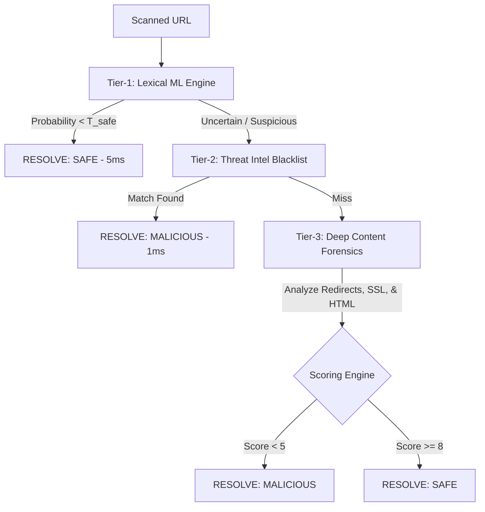

# CyberGuard AI: Real-Time QR Embedded URL Phishing Detection

[](https://expo.dev/)
[](https://flask.palletsprojects.com/)
[](https://firebase.google.com/)
[](https://xgboost.readthedocs.io/)

A state-of-the-art hybrid security system designed to detect and block malicious URLs embedded inside QR codes before they can compromise users. This project leverages an **Uncertainty-Aware Cascade Architecture** combining lightweight machine learning with deep content forensics and real-time threat intelligence.

---

## 🛡️ System Architecture: The 3-Tier Cascade

To optimize latency and processing costs while maintaining 99% detection accuracy, CyberGuard AI implements a cascaded routing protocol:



### 1. **Tier-1: Lexical Machine Learning (Fast Safe Filter)**
* **Latency:** ~5ms
* **Stack:** Python, XGBoost, Scikit-Learn
* **Mechanism:** Extracts a 17-dimensional feature vector from the raw URL (Shannon Entropy, Subdomain Depth, Suspicious TLDs, DGA consonants, and Brand Token Mismatches). Safe URLs are cleared instantly, bypassing expensive scans.

### 2. **Tier-2: Threat Intelligence (O(1) Blacklist)**
* **Latency:** ~1ms
* **Stack:** Flask-SocketIO, Firebase Firestore (Real-Time Listener)
* **Mechanism:** Checks the domain against an in-memory database of active zero-day phishing sites. The memory set is synced in real-time with Firestore using background snapshot listeners.

### 3. **Tier-3: Deep Content Forensics (Comprehensive Audit)**
* **Latency:** ~4s - 8s (Parallelized)
* **Stack:** BeautifulSoup4, Requests, Python ThreadPoolExecutor
* **Mechanism:** Visits the site in the background to analyze redirects, evaluate SSL certificate validity, search for hidden password fields or forms routing data to external endpoints, and compare visual brands to the domain.

---

## 📱 Mobile App Features (Frontend)
* **Optical Scanner:** Custom QR scanner built with `expo-camera` featuring scan target overlay and haptic feedback.
* **Wi-Fi Sentinel:** Built-in network scanner to check for DNS hijacking, captive portal evil twins, and rogue router IPs.
* **Audit Logs:** Full user history of past intercepts, verdicts, confidence levels, and latency metrics stored locally and in Firestore.
* **Architecture Terminal:** Explains the scanning mechanics and showcases the development team.

---

## 🚀 Setup & Installation

### Backend Setup (Flask Server)
1. Navigate to the backend directory:
   ```bash
   cd backend
   ```
2. Create and activate a Python virtual environment:
   ```bash
   python -m venv venv
   # On Windows (PowerShell)
   .\venv\Scripts\Activate.ps1
   # On macOS/Linux
   source venv/bin/activate
   ```
3. Install dependencies:
   ```bash
   pip install -r requirements.txt flask-cors flask-socketio eventlet firebase-admin
   ```
4. Place your Firebase Admin SDK service account key JSON as `firebase-credentials.json` inside the `backend` folder.
5. Start the server:
   ```bash
   python app.py
   ```

### Frontend Setup (Expo App)
1. Navigate to the frontend directory:
   ```bash
   cd frontend
   ```
2. Install packages:
   ```bash
   npm install --legacy-peer-deps
   ```
3. Create a `.env` file and populate your Firebase client keys (use `.env` template):
   ```env
   EXPO_PUBLIC_FIREBASE_API_KEY=your_api_key
   EXPO_PUBLIC_FIREBASE_AUTH_DOMAIN=your_auth_domain
   EXPO_PUBLIC_FIREBASE_PROJECT_ID=your_project_id
   EXPO_PUBLIC_FIREBASE_STORAGE_BUCKET=your_storage_bucket
   EXPO_PUBLIC_FIREBASE_MESSAGING_SENDER_ID=your_sender_id
   EXPO_PUBLIC_FIREBASE_APP_ID=your_app_id
   EXPO_PUBLIC_FIREBASE_MEASUREMENT_ID=your_measurement_id
   ```
4. Run the Metro bundler:
   ```bash
   npx expo start
   ```

---

## 📄 Reference Research
For detailed mathematical proof, model training protocols, and system performance evaluations, refer to the included **IEEE Research Paper** located in the root of this project:
* 📁 `Real_Time_QR_Phishing_Detection_Paper.pdf` (or your copied file name)
