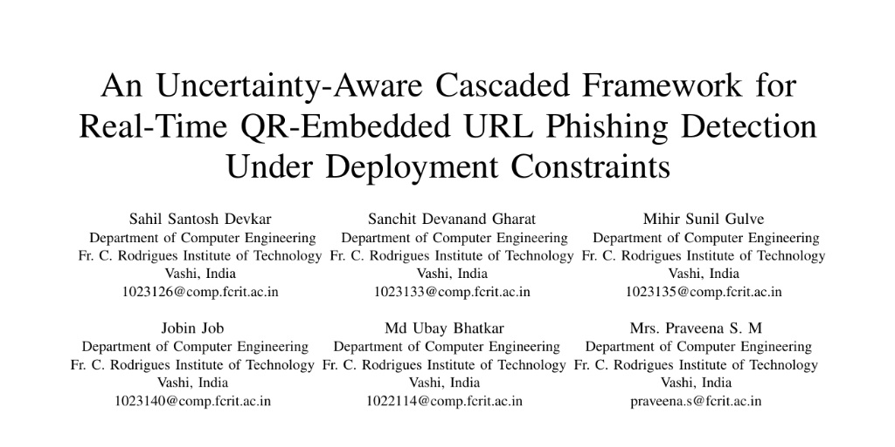
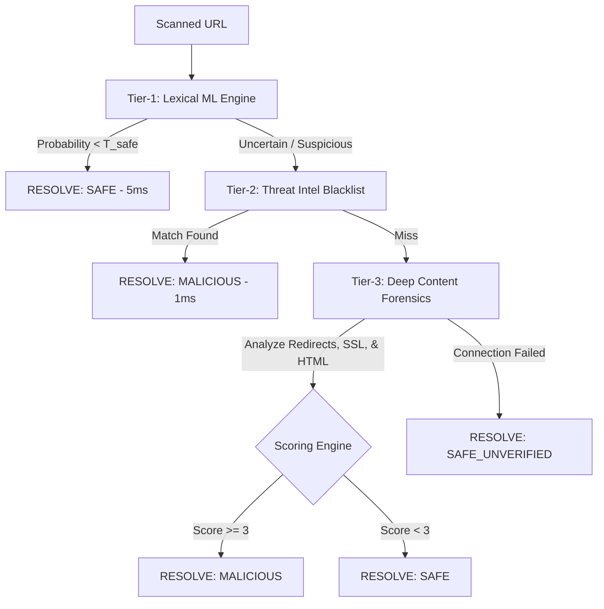

# An Uncertainty-Aware Cascaded Framework for Real-Time QR-Embedded URL Phishing Detection Under Deployment Constraints



Official implementation of the research paper: **"An Uncertainty-Aware Cascaded Framework for Real-Time QR-Embedded URL Phishing Detection Under Deployment Constraints"**

[](https://expo.dev/)
[](https://flask.palletsprojects.com/)
[](https://firebase.google.com/)
[](https://xgboost.readthedocs.io/)

---

## 👥 Authors & Affiliation
* **Sahil Santosh Devkar** (`sahildevkar789`)
* **Jobin Job**
* **Sanchit Devanand Gharat** (`sanchitgharat-07`)
* **Md Ubay Bhatkar**
* **Mihir Sunil Gulve**
* **Mrs. Praveena S. M**

*Department of Computer Engineering, Fr. C. Rodrigues Institute of Technology, Vashi, India*

---

## 📝 Abstract
> The increasing use of QR codes in payments, authentication, and information access has led to QR-based phishing, or quishing, where malicious URLs are embedded in QR codes and executed upon scanning. This type of attack bypasses conventional browser-based defenses. Real-time detection is necessary, but lightweight classifiers that could be used at the time of scanning have structural recall limitations against advanced phishing infrastructure. 
> 
> We present an **uncertainty-aware cascaded detection framework** that directs extracted URLs from QR codes through three levels of deep analysis. **Tier-1** uses a calibrated XGBoost classifier on a 17-dimensional lexical feature vector; Isotonic Regression calibration probabilities drive an uncertainty-based escalation threshold. **Tier-2** does O(1) in-memory root domain lookup against a self-curating proprietary blacklist where every Tier-3 confirmed malicious domain is automatically appended for sub-millisecond re-detection of repeat threats without model retraining. **Tier-3** uses a weighted forensic scoring function over ten structural and behavioral signals with a soft-fail guarantee which ensures no user gets blocked if inspection fails.
> 
> Tested on a stratified 80/20 split of **8,411,061 URLs**, Tier-1 gets **90.84% accuracy, 73.19% recall** with an **AUC-ROC of 0.9304** at a high-confidence precision of **97.90%** and escalation rate at **36.47%**. Live testing on 200 known phishing URLs shows a reachability rate of 9.5%, with recall at 73.68% for reachable ones. More importantly, we show that the soft-fail guarantee letting unreachable URLs go as `SAFE_UNVERIFIED` has an actual recall cost under evasion-capable phishing infrastructure; it gives a predicted cascade recall of **68.57%**. We define this soft-fail recall tradeoff as an unquantified deployment challenge and suggest `SUSPICIOUS_UNVERIFIED` as a confidence-weighted mitigation for future research endeavors.

---

## 🛡️ System Architecture: The 3-Tier Cascade


* 📄 [Download / View System Architecture (PDF)](overall_architecture.pdf)



### 1. **Tier-1: Lexical Machine Learning (Fast Safe Filter)**
* **Latency:** ~5ms
* **Stack:** Python, XGBoost, Scikit-Learn
* **Mechanism:** Extracts a 17-dimensional feature vector from the raw URL (Shannon Entropy, Subdomain Depth, Suspicious TLDs, DGA consonants, and Brand Token Mismatches). Safe URLs (probability < 0.05) are cleared instantly, bypassing expensive scans.

### 2. **Tier-2: Threat Intelligence (O(1) Blacklist)**
* **Latency:** ~1ms
* **Stack:** Flask-SocketIO, Firebase Firestore (Real-Time Listener)
* **Mechanism:** Checks the domain against an in-memory database of active zero-day phishing sites. The memory set is synced in real-time with Firestore using background snapshot listeners.

### 3. **Tier-3: Deep Content Forensics (Comprehensive Audit)**
* **Latency:** ~4s - 8s (Parallelized)
* **Stack:** BeautifulSoup4, Requests, Python ThreadPoolExecutor
* **Mechanism:** Visits the site in the background to analyze redirects, evaluate SSL certificate validity, search for hidden password fields or forms routing data to external endpoints, and compare visual brands to the domain.

---

## 📱 Mobile App Features (Frontend)
* **Optical Scanner:** Custom QR scanner built with `expo-camera` featuring scan target overlay and haptic feedback.
* **Wi-Fi Sentinel:** Built-in network scanner to check for DNS hijacking, captive portal evil twins, and rogue router IPs.
* **Audit Logs:** Full user history of past intercepts, verdicts, confidence levels, and latency metrics stored locally and in Firestore.
* **Architecture Terminal:** Explains the scanning mechanics and showcases the development team.

---

## 🚀 Setup & Installation

### Backend Setup (Flask Server)
1. Navigate to the backend directory:
   ```bash
   cd backend
   ```
2. Create and activate a Python virtual environment:
   ```bash
   python -m venv venv
   # On Windows (PowerShell)
   .\venv\Scripts\Activate.ps1
   # On macOS/Linux
   source venv/bin/activate
   ```
3. Install dependencies:
   ```bash
   pip install -r requirements.txt flask-cors flask-socketio eventlet firebase-admin
   ```
4. Place your Firebase Admin SDK service account key JSON as `firebase-credentials.json` inside the `backend` folder.
5. Start the server:
   ```bash
   python app.py
   ```

### Frontend Setup (Expo App)
1. Navigate to the frontend directory:
   ```bash
   cd frontend
   ```
2. Install packages:
   ```bash
   npm install --legacy-peer-deps
   ```
3. Create a `.env` file and populate your Firebase client keys (use `.env` template):
   ```env
   EXPO_PUBLIC_FIREBASE_API_KEY=your_api_key
   EXPO_PUBLIC_FIREBASE_AUTH_DOMAIN=your_auth_domain
   EXPO_PUBLIC_FIREBASE_PROJECT_ID=your_project_id
   EXPO_PUBLIC_FIREBASE_STORAGE_BUCKET=your_storage_bucket
   EXPO_PUBLIC_FIREBASE_MESSAGING_SENDER_ID=your_sender_id
   EXPO_PUBLIC_FIREBASE_APP_ID=your_app_id
   EXPO_PUBLIC_FIREBASE_MEASUREMENT_ID=your_measurement_id
   ```
4. Run the Metro bundler:
   ```bash
   npx expo start
   ```

---

## 📄 Reference Research
For detailed mathematical proof, model training protocols, and system performance evaluations, refer to the included documents:
* 📁 [Real_Time_QR_Phishing_Detection_Paper.pdf](Real_Time_QR_Phishing_Detection_Paper.pdf) (Research Paper)
* 📁 [overall_architecture.pdf](overall_architecture.pdf) (Architecture Diagram)
